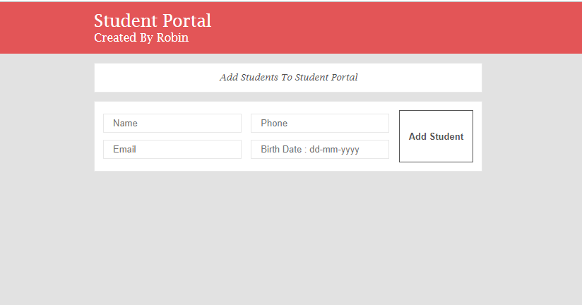

# Student Portal
A web app to store data about students.
## Screenshot 1

## Screenshot 2

## How to create your own copy of this app?
### Prerequisites
To create an own copy of this application, you have one prerequisite. That is -
 - [Meteor](https://www.meteor.com/) installed on your system.
 - [NodeJS](https://nodejs.org/en/)(optional)

### Make own copy
First clone the repository using:

    git clone https://github.com/robin3317/meteor-react-student-portal.git

Then install the dependencies using:

    meteor npm install

 Run the following command to run the app on the app.

    meteor

Now, you have your own copy of this application!

Made with ❤️ by [Abdur Rahman Robin](https://twitter.com/robin4java)
